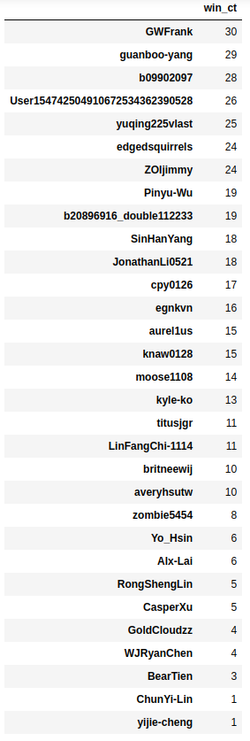

# Leaderboard


# How to see leaderboard table? (win rate of every pairs)
table[agent1][agent2] means the win rate of agent 1 when agent1 playing black and agent2 playing white.
```
import pandas as pd
leaderboard_table = pd.read_pickle("leaderboard_table.pkl")
```
# How to see the leaderboard?
```
import pandas as pd
leaderboard_win_ct = pd.read_pickle("leaderboard_win_ct.pkl")
```

# Reversi Game Project
### Prerequsite
```
$ pip install pygame
$ pip install tqdm
$ pip install numpy
```
### Repo structure
```
.
├── README.md
├── agent
│   └── base_agent.py
├── arena.py
├── board.py
├── env.py
├── font
│   ├── LICENSE.txt
│   └── OpenSans-Regular.ttf
├── pygamewrapper.py
├── reversi.py
├── reversi_board.py
└── utils.py
```


### Usage
```
$ git clone https://github.com/cwlin1998/reversi-pygame.git
$ cd reversi-pygame
$ python3 arena.py --time_limit=600000
```

Now you can play with an AI
### Github tutorial 
[Our slide](https://docs.google.com/presentation/d/1X0YmTyj4BNnG7E8saxtG-jH9XLWm8OiFG3L21HhgRwc/edit#slide=id.gacd295469b_2_15)

### Python tutorial

[Our slide](https://docs.google.com/presentation/d/1pyyqS0QBvdS6jl4sLFFINce6fYdUXPpX9f47-3n6AME/edit?usp=sharing)

### Markdown tutorial

[Our slide](https://docs.google.com/presentation/d/1BrGTMmXFdGQpRkhMQs3FPhjOsyPv-EwPOy3bguRlIbI/edit?usp=sharing)


###  Preparation for Team Project
1. [Duplicate this repo](https://docs.github.com/en/free-pro-team@latest/github/creating-cloning-and-archiving-repositories/duplicating-a-repository) and make it private.
> Thanks to [GWFrank](https://github.com/GWFrank) providing the solution.
2. Add your teamates and TA to your repo.
3. Write your member name in your README.
For example:
    ### Team members
    - Team leader:
        - name: Cheng-Wei Lin
        - student_id: r09922078
        - github: [cwlin1998](https://github.com/cwlin1998)
    - member:
        - name: Chi-Ming Chung
        - student_id: r09944021
        - github: [MarvinChung](https://github.com/MarvinChung)

## Todo
- Write an agent for your game:
    - You need to inherit BaseAgent and write your own agent
    ```
    class MyAgent(BaseAgent):
        def step(self, obs, reward):
            # override this function
            # strongly suggest: write a function to get valid actions
    ```
    - Put your agent in agent_folder and name it using your team leader's github id with a suffix.
    For example:
    ```
    ├── agent
    │   ├── cwlin1998.py
    │   ├── cwlin1998_func/    # put your other files under this folder
    │   └── base_agent.py 
    ```
    
    - **Your agent should not exceed the time limit (30s) per game, otherwise you lose the game.**
- Test your agent
    ```
    $ python3 arena.py --agent1 cwlin1998.MyAgent --agent2 base_agent.RandomAgent
    ```
- Write your report
    
    - Put your report in README.md. Learn how to write markdown
    
- Work as a team and learn how to use github and read code :100: 

## Limitation
- 4GB file
- 4GB memory usage 
- 4 threads
- If you want to use third-party packages other than numpy, pygame, pytorch and tensorflow, report an issue. (We suggest using rule based algorithm)


## Grading policy
### Learn Github (60%)
- (**10 %**) Duplicate our repo
    - When your duplicate this repo and add TAs into your repo you get 8 points.
    - You get 2 points when you add your teammates and show their name in README.md.
- (**10 %**) Create your own branch and clean our branches
    - Delete all of our branches except main.
    - Create your own branches.
- (**10 %**) Protect main branch 
    - Merge only when all teammember(not including TAs) approves.
    - Main branch should be clean. No redundacy code and bug.
    - You will need to use git branch and learn how to use git rebase.
- (**10 %**) All members should collaborate together and use pull request.
    
    - Disccus to each other.
- (**10 %**) Use git tag to do version control
    - For example: 
        - tag name: v1.0, v1.1 ....
    - TA will grade your code using the latest tag
- (**10 %**) Write the report in your README.md
    - Describe how you made your agent. Example: What algorithm you use?
    - You can write your report on top of this README.md after forking
        - For example:
            # Reversi Game Project
            ### Team members
            - Team leader:
                - name: Cheng-Wei Lin
                - student_id: r09922078
                - github: [cwlin1998](https://github.com/cwlin1998)
            - member:
                - name: Chi-Ming Chung
                - student_id: r09944021
                - github: [MarvinChung](https://github.com/MarvinChung)
            ### Report
            I don't have time therefore I submit random agent.

### Python coding (40 %) 
- (**10 %**) Your agent can be run
    - You can even copy paste our RandomAgent and change the name to get 10 points. 
- (**10 %**) Pass the baseline
    - We will test your agent agaist RandomAgent. You need to have an at least 80% win rate to get 10 points.
    - **Caution: Please do not exceed time limit(30s per game)**
- (**20 %**) Leaderboard
    - We will test all your agents and you will fight with each others.
    - Your team will get 1 point if you beat another team. (You can get 20 points at most.) Try to beat  your classmates! :punch:
    - Don't give others your code! :no_good:
    - **The leaderboard will be announced.** 
    You have one month for this HW. Good luck!

## QA

1. Put your questions in issues inside this repo.
2. **Bonus:**
    If you find bugs :beetle: in TAs' repo. you can report it with issues and fix it with pull request then you may get bonus points. :thumbsup:
